## iptables

通过配置文件的方式创建nginx Pod

```
apiVersion: v1
kind: Deployment
metadata:
  name: nginx-deployment
spec:
  selector:
    matchLabels:
      app: nginx
  replicas: 2
  template:
    metadata:
      labels:
        app: nginx
    spec:
      containers:
      - name: nginx
        image: nginx:latest
        ports:
        - containerPort: 80
    
```

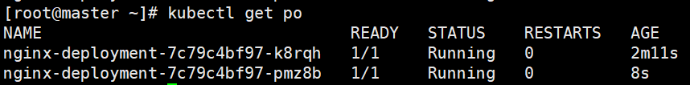

再使用刚刚定义的service yaml 创建服务

```yaml
apiVersion: v1
kind: Service
metadata:
  name: ngx-svc
spec:
  ports:
  - name: http
    port: 80
    targetPort: 80
  selector:
    app: nginx
  type: ClusterIP
```

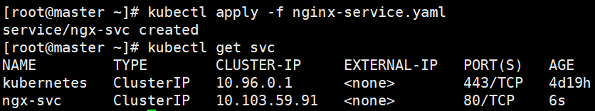

查看后端暴露的Pod地址和端口

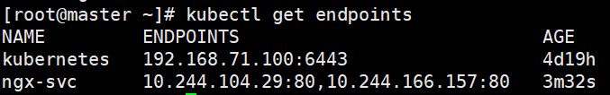

即是后端服务service对集群的暴露端口为`10.103.59.92`，当请求这个地址时，会根据`iptables`策略转发到`service`上的`ENDPOINTS`上

由于使用了Deployment进行部署，所以杀死任何一个nginx的Pod，都会立即再拉起一个Pod，始终保证Pod的数量为2，并且还会为其重新分配地址

查看KUBE-SERVICES规则

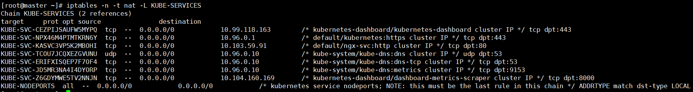

当访问ClusterIP:{dpt:80}的时候则会匹配第三条规则，则会跳转到地址 default/ngx-svc:http

查看规则详情，则发现当目的地为`0.0.0.0/0`规则的匹配IP和端口的时候，则会跳转到两个PodIP地址的任何一个，匹配规则为随机，第一个概率为50%

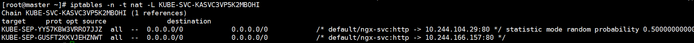

再选择第一个规则进行查看，发现在规则中实现了DNAT，将ClusterIP地址转化为容器内地址

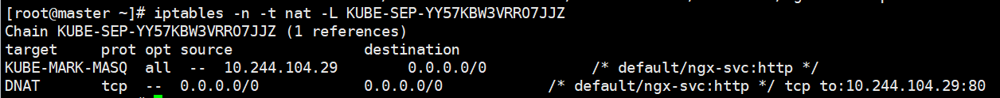

其中KUBE-MARK-MASQ规则是在容器外的网络访问的将流量打上标签，即节点内，容器外

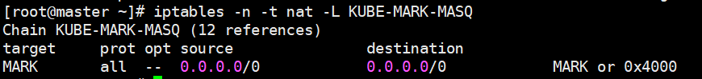

在所有的iptables规则集中，找到POSRTROUTING规则

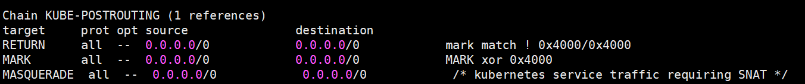

其中有一条为`MASQUERADE`，即是将打标签的流量进行SNAT源地址转换，让流量能原路返回

在使用ClusterIP类型创建服务时，服务只对集群内暴露，当设置为NodePort时，则会将节点的物理网卡中选择一个Port对其进行访问

## Service类型

### Headless Service

通过对Cluter IP设置为"None"，则不会对其分配服务地址，kube-proxy也不会对访问它的流量做iptables规则，这种方式可实现客户端路由，

当客户端访问服务的时候，进行DNS解析时，会将其包含的所有ENDPOINTS的IP地址进行返回，因此可以实现客户端负载均衡

### ExternalName Service

查找CNAME记录，将服务发现给外部的DNS

```
type: ExternalName
externalName: ylzhong.top
```

## DNS

Pod和Service都会产生DNS记录

通过查询Pod可以得知每一个节点的k8sDNS服务IP地址

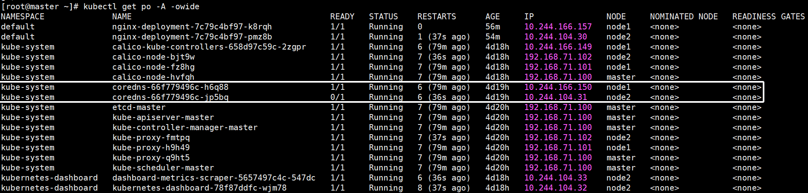

查询当中一个nginx Pod的域名解析记录

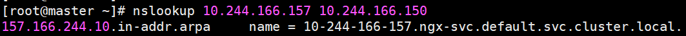

当ClusterIP设置为None的时候，Service生成的DNS记录

```toml
ngx-svc.default.svc.cluster.local.4 IN A 10.103.59.91
```

如果设置为None，则生成的DNS记录

```toml
ngx-svc.default.svc.cluster.local.4 IN A 10.244.104.29.80
ngx-svc.default.svc.cluster.local.4 IN A 10.244.166.157.80
```

如果设置为External，则生成DNS记录

```toml
ngx-svc.default.svc.cluster.local.10 IN CNAME www.ylzhong.top
ylzhong.top 28715 IN A 192.168.100.100
```

同样，如果想自定义解析方式，则可以修改`vim /etc/resolv.conf`

```conf
# Generated by NetworkManager
nameserver 114.114.114.114
nameserver 8.8.8.8           
```


## calico

介绍组件作用

对于从节点来说，对每一个Pod都会创建一个虚拟网卡与caliconode进行连接，主机网络的流量会从物理网卡出去

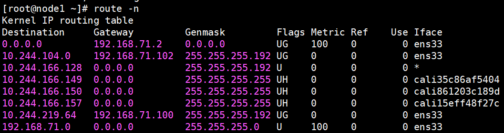

同样对于Pod网络到其他节点网络也记录在了路由表中，通过物理网口传输（BGP模式）